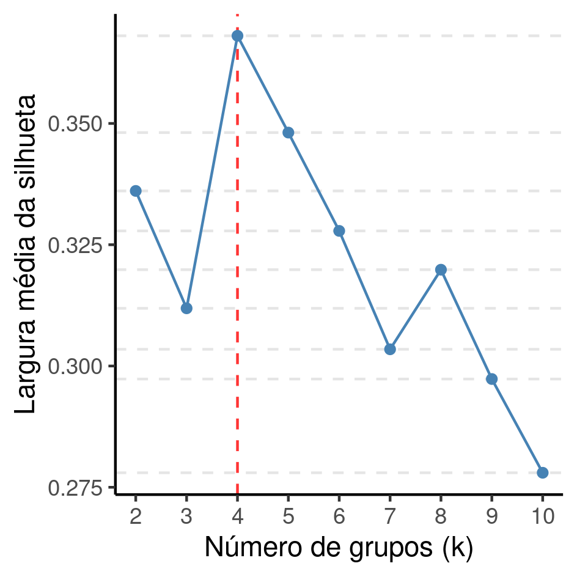

```{r setup, include=FALSE}
knitr::opts_chunk$set(echo = FALSE)
knitr::opts_knit$set(root.dir = normalizePath(".."))
options(scipen = 999)
library(pander)
library(knitr)
library(philsfmisc)
panderOptions('table.style', 'rmarkdown')
panderOptions('table.split.table', 160)
```

---

**Histórico do documento**

```{r history}
Version <- c("01")
Changes <- c("Versão inicial")
history <- cbind(Version, Changes)
colnames(history) <- c("Versão", "Alterações")
# pander(history, split.cells = 70)
kable(history)
```

---

# Lista de abreviaturas

- BSS: soma dos quadrados inter grupos (*between sum of squares*)
- DP: desvio padrão
- TSS: soma dos quadrados total (*total sum of squares*)
- WSS: soma dos quadrados intra grupos (*within sum of squares*)

# Introdução

Avaliação da qualidade do agrupamento de acordo com dois critérios: altura da árvore e número putativo de clusters.
Criação do elbow plot para auxiliar a tomada de decisão no uso do kmeans.

Esta análise testou a hipótese de que
deputados federais evangélicos que foram eleitos em 2018 podem ser identificados com base nas doações recebidas durante a campanha eleitoral, número de votos recebidos e outras características.

O posicionamento político dos deputados foi identificado pelo índice de Power e Silveira-Rodrigues que varia de -1 a 1, onde -1 é mais à esquerda e 1 mais à direita.

A capilaridade é um índice de 0 a 1 que indica quão ampla (sob o ponto de vista geográfico) foi a votação do candidato.
Quanto maior o número de zonas eleitorais onde o candidato recebeu votos, maior o índice.
Este indicador é a média dos percentis de cada zona eleitoral em que o candidato concorreu.

A classificação dos deputados como pertencendo ou à classe evangélica foi estabelecida por autodenominação, isto é, foram considerados evangélicos os deputados que se autodenominaram como tal.

## Objetivos

1. Avaliar número ideal de clusters de acordo em um dendograma de clusterização hierárquica, para uso do kmeans.
1. Avaliar em particular a acurácia do agrupamento aplicado em 2 clusters com a proposta de identificar os deputados da bancada evangélica vs outros, de acordo com a classificação pré estabelecida.

## Recepção e tratamento dos dados

Base de dados recebida contendo características dos deputados federais eleitos em 2018.
Todas as variáveis da tabela de dados analíticos foram identificadas de acordo com as descrições das variáveis, e os valores foram identificados de acordo com o dicionário de dados providenciado.
Estas identificações possibilitarão a criação de tabelas de resultados com qualidade de produção final.

Foram feitos ajustes de escala em variáveis para viabilizar a performance dos algoritmos, mantendo a interpretabilidade dos dados.
O número de votos, o número de filiados do partido foram padronizados por milhão e todas as variáveis relativas às receitas foram padronizados em milhões de reais -- com estas novas escalas todas as variáveis da base tiveram suas amplitudes reduzidas entre 0 e 2.5.
O posicionamento foi mantido em sua escala original por já ter amplitude de tamanho 2 (entre -1 e 1).

Uma observação não tinha o número de votos registrada, e foi removida para a análise de clusters.

# Metodologia

```{r results, include=FALSE}
source("scripts/results.R", encoding = 'UTF-8')
```

## Variáveis

### Desfechos primário e secundário

O desfecho primário está definido como o número ótimo de clusters para uso no algoritmo k-means.
O número de clusters foi definido de acordo com a largura média da silhueta no agrupamento hierárquico.

O desfecho secundário é a avaliação do k-means com dois clusters (k=2) para a classificação entre deputados da bancada evangélica e outros deputados explicada pela receita total recebida.

### Covariáveis

As seguintes características dos deputados federais foram consideradas para inclusão na análise: Número de votos recebidos, posicionamento político, capilaridade, a unidade da federação, o partido (sigla), o sexo e se é o primeiro mandato.
As seguintes características dos partidos foram consideradas para inclusão na análise:  decil do número de deputados eleitos e decil do número de filiados.

As receitas discriminadas em suas diversas origens não foram consideradas na análise principal, pois a densidade das distribuições indica que a maior parte dos deputados não recebeu valores em cada uma destas fontes (figura A1).
O número de filiados do partido também não foi incluido em favor do decil de filiados do partido.
O impacto da exclusão destas variáveis na clusterização foi avaliado em uma análise de sensibilidade.

## Análises Realizadas

As características dos deputados foram descritas como
média (DP)
<!-- mediana (IIQ) -->
ou frequência e proporção (%),
conforme apropriado.
As distribuições foram sumarizadas em tabelas e visualizadas em gráficos exploratórios.

O número ótimo de clusters foi determinado por dois métodos: agrupamento hierárquico e o elbow plot do k-means.

O agrupamento hierárquico foi realizado usando a distância euclidiana e o critério de ligação completa (*complete linkage*).
O agrupamento hierárquico foi avaliado pelo método da silhueta, onde as larguras das silhuetas de cada observação são calculadas individualmente resultando em uma medida interpretável do pertencimento ao cluster avaliado.
Valores positivos de silhueta indicam um bom ajuste da observação ao cluster.
A média das larguras das silhuetas foi calculada como critério de avaliação global do agrupamento hierárquico.

O agrupamento diretamente pelo método k-means também foi avaliado pela redução do WSS total (elbow plot).
Após a determinação do número ótimo de clusters, dois agrupamentos k-means foram realizados para diagnóstico usando a distância euclidiana e 10 centroides iniciais aleatórios -- o primeiro usando o número ótimo de clusters (desfecho primário) e o segundo usando dois clusters (desfecho secundário).
O agrupamento do k-means foi avaliado globalmente com o WSS total e foi apresentada a proporção da variância entre grupos que é explicada pelo agrupamento.
Esta proporção foi calculada como $\text{variância explicada} = \frac{BSS}{TSS} \times 100$.

Esta análise foi realizada utilizando-se o software `R` versão `r getRversion()`.

# Resultados

## Análise descritiva
<!-- dados da tabela adhoc em describe.R -->
Em 2018 foram eleitos 116 (23% dos deputados avaliados) deputados federais que se autodenominaram evangélicos.
Destes,
29 (25%) estão filiados à igreja AD,
21 (18%) à igreja IURD e
15 (13%) à igreja Batista.
Observa-se nas duas classes de deputados federais uma predominância do sexo masculino, com
91 (78%) homens entre os deputados evangélicos e
345 (87%) homens dentre as demais classes
(Tabela 1).
O deputado federal evangélico parece ter posicionamento político mais alinhado à direita, com índice de Power e Silveira-Rodrigues médio 0.7.

A maior parte dos deputados federais eleitos em 2018 foram eleitos em primeiro mandato.
Dentro os deputados evangélicos
94 (81%) se elegeram pela primeira vez e
22 (19%) foram reeleitos.
Os candidatos evangélicos obtiveram, na média, 127 mil votos,
quando os outros deputados obtiveram 97 mil votos.
Apesar da discrepância nas médias de performance de votos, a variabilidade deste indicador é substancialmente maior na classe de deputados evangélicos, com desvio padrão superior à média.
A variabilidade entre os dois grupos pode ser comparada pelo CV -- o CV dos deputados evangélicos foi 157% enquanto nos outros foi 60%.
Ambos os grupos tiveram capilaridade semelhante, em torno de 0.8 na média.

Os partidos tiveram desempenho comparáveis, onde tanto
o decil do número de deputados eleitos como
o decil do número de filiados
ficaram na faixa entre 0,7 e 0,8 (Tabela 1).
Os partidos que mais abrigaram os deputados evangélicos eleitos foram o
PRB com	23 (20%) deputados,
PSL com	16 (14%),
PR com	10 (8.6%) e
os partidos com menor representatividade desta classe foram
PATRIOTA,
PMN,
PRP e
PTC
todos com 1 (0.9%) deputado.

```{r tab_desc}
tab_desc %>%
    as_kable(
    align = "lccc",
    caption = "**Tabela 1** Características dos deputados federais eleitos em 2018."
  )
```

A receita total obtida pelos deputados evangélicos foi comparável aos demais deputados, com ambas as classes atingindo receita média superior a 1 milhão de reais.
Os deputados evangélicos obtiveram, na média, 1.08 milhões de reais (desvio padrão 0.7 milhões, CV 64%) e
os demais deputados 1.12 milhões de reais (desvio padrão 0.7 milhões, CV 60%).
A amplitude das receitas observadas variou entre
R\$ 21648 e R\$ 2507377 entre os deputados evangélicos e
R\$ 12075 e R\$ 2500500 entre os demais (Tabela 1 e Figura 1).

```{r fig1, fig.cap="**Figura 1** Distribuição da receita total dos deputados federais eleitos em 2018."}
# 
knitr::include_graphics("../figures/receita_total.png", error = FALSE)
```

## Determinação de clusters para k-means: cluster hierárquico

### Número ótimo de clusters

O agrupamento hierárquico foi avaliado para números de clusters (k) entre 2 e 10, e as silhuetas médias de cada agrupamento particular foram calculadas (Figura 2).
O número de clusters com maior silhueta média é k = 4.

```{r fig2, fig.cap="**Figura 2** Variação da silhueta média do cluster hierárquico para diferentes valores de k."}
# 
knitr::include_graphics("../figures/silhouette.png", error = FALSE)
```

```{r silhuetas4, include=FALSE}
hc4_sum <- summary(hc4_sil)
hc4_avg.width <- format.float(hc4_sum$avg.width)
hc4_clus.sizes <- hc4_sum$clus.sizes
hc4_clus.avg.widths <- format.float(hc4_sum$clus.avg.widths)
```

Estipulando o número ótimo de clusters em k = 4, as silhuetas das observações variam entre
`r format.float(min(hc4_sum$si.summary))` e
`r format.float(max(hc4_sum$si.summary))` com
média `r format.float(hc4_sum$si.summary["Mean"])` e
mediana `r format.float(hc4_sum$si.summary["Median"])`.
Este agrupamento em particular pode ser identificado cortando-se o dendrograma do agrupamento hierárquico na altura h = 2.2 (Figura 3).
Isto significa que a maior distância entre dois clusters não supera h = 2.2.

As silhuetas médias dos clusters indicam que o agrupamento foi bem sucedido em discriminar características dos deputados com os dados avaliados.
O cluster 1 incluiu n = `r hc4_clus.sizes[1]` deputados e possui silhueta média `r hc4_clus.avg.widths[1]`,
o cluster 2 incluiu n = `r hc4_clus.sizes[2]` deputados e possui silhueta média `r hc4_clus.avg.widths[2]`,
o cluster 3 incluiu n = `r hc4_clus.sizes[3]` deputados e possui silhueta média `r hc4_clus.avg.widths[3]` e
o cluster 4 incluiu n = `r hc4_clus.sizes[4]` deputados e possui silhueta média `r hc4_clus.avg.widths[4]`.

```{r fig3, fig.cap="**Figura 3** Dendrograma do cluster hierárquico, corte na altura h = 2.2."}
# 
knitr::include_graphics("../figures/dendrograma.png", error = FALSE)
```

### Descrição dos clusters

<!-- A tabela 2 mostra as características dos 4 clusters. -->
Os quatro clusters obtidos não foram suficientes para discriminar os deputados evangélicos do restante, mas a maioria destes ficou distribuída em dois dos grupos (clusters 1 e 2 na Tabela 2).
O cluster 1 tem 226 deputados (verde na figura 3) e em sua composição 30% dos deputados incluídos são evangélicos, enquanto o cluster 2 tem 153 deputados dos quais 24% são evangélicos (vermelho na figura 3).
A principal característica que difere entre esses clusters é a receita total onde o cluster 1 obteve em torno de R\$ 700 milhões e o cluster dois obteve quase R\$ 2 milhões.

```{r tab_cl4}
tab_cl4 %>%
  as_kable(
    caption = "**Tabela 2** Características dos clusters de deputados federais eleitos em 2018, determinadas por agrupamento hierárquico com k = 4 clusters."
  )
```

O cluster 3 (azul na Figura 3) parece identificar a maioria dos deputados com posicionamento mais à esquerda (Índice de Power e Silveira-Rodrigues negativo), e possui baixa representatividade de deputados evangélicos (n=10, 8% do grupo).

É possível identificar um cluster pequeno (n=2) que agrupou dois deputados com mais de 1 milhão de votos (cluster 4 na Tabela 2, verde escuro na Figura 3).
Ambos são evangélicos.

## Avaliação dos clusters do método k-means

O método k-means foi utilizado de forma exploratória para determinação do número ótimo de clusters conforme mensurado pela queda do WSS.
Foram avaliados os possíveis números de clusters (k) de 1 a 10.
O número ótimo de clusters obtido foi k = 3, onde houve a queda de WSS mais expressiva (Figura 4).
Usando k = 3 clusters o WSS total foi `r format.float(km3$tot.withinss)` que explica `r format.pct(pct.km3)` da variância entre os grupos.

```{r fig4, fig.cap="**Figura 4** Elbow plot do método k-means."}
# 
knitr::include_graphics("../figures/elbow.png", error = FALSE)
```

## Caso particular com k=2 clusters

Os métodos descritos nas seções anteriores foram aplicados ao caso particular de se buscar exatamente 2 agrupamentos que discriminassem os deputados evangélicos dos demais.

**Clusterização hierárquica**

```{r silhuetas2, include=FALSE}
hc2_sum <- summary(hc2_sil)
hc2_avg.width <- format.float(hc2_sum$avg.width)
hc2_clus.sizes <- hc2_sum$clus.sizes
hc2_clus.avg.widths <- format.float(hc2_sum$clus.avg.widths)
```

Estipulando o número de clusters em k = 2 no agrupamento hierárquico, as silhuetas das observações variam entre
`r format.float(min(hc2_sum$si.summary))` e
`r format.float(max(hc2_sum$si.summary))` com
média `r format.float(hc2_sum$si.summary["Mean"])` e
mediana `r format.float(hc2_sum$si.summary["Median"])`.
O cluster 1 incluiu n = `r hc2_clus.sizes[1]` deputados e possui silhueta média `r hc2_clus.avg.widths[1]` e
o cluster 2 incluiu n = `r hc2_clus.sizes[2]` deputados e possui silhueta média `r hc2_clus.avg.widths[2]`.

A tentativa de agrupar os deputados em k = 2 clusters não identificou um grupo com maioria de evangélicos, com ambos os clusters incluindo cerca de 20% de deputados evangélicos (Tabela 3) com os dados incluídos na análise.
A principal característica que parece discriminar estes grupos é a receita total recebida, onde o cluster 1 obteve em média R\$ 760 mil, enquanto o cluster 2 obteve próximo de R\$ 2 milhões.

```{r tab_cl2}
tab_cl2 %>%
  as_kable(
    caption = "**Tabela 3** Características dos clusters de deputados federais eleitos em 2018, determinadas por agrupamento hierárquico com k = 2 clusters."
  )
```

**Método k-means**

A qualidade do agrupamento por k-means também foi avaliada para este caso particular.
Usando k = 2 clusters o WSS total foi `r format.float(km2$tot.withinss)` que explica `r format.pct(pct.km2)` da variância entre os grupos.

## Sensibilidade da análise à exclusão de variáveis

O método elbow plot para determinação do número de clusters do k-means não demonstrou sensibilidade à exclusão das variáveis de origens individuais de receita e número de filiados, tendo resultado no mesmo número k=3 de clusters da análise principal (Figura 5).
Com o número ótimo de clusters (k = 3) o WSS total foi `r format.float(km3.fd$tot.withinss)` que explica `r format.pct(pct.km3.fd)` da variância.

Usando k = 2 clusters o WSS total foi `r format.float(km2.fd$tot.withinss)` que explica `r format.pct(pct.km2.fd)` da variância.

```{r fig5, fig.cap="**Figura 5** Elbow plot do método k-means com o dataset completo."}
# 
knitr::include_graphics("../figures/elbow_full.png", error = FALSE)
```

O método de agrupamento hierárquico se mostrou sensível à exclusão destas variáveis.
Com o dataset completo o número ótimo de clusters é k=8 onde 
a maior silhueta média foi `r format.float(hc_sil(hc.c.fd, 8, nb.dist.fd))` (figura 6).
Esta silhueta média é substancialmente menor que o resultado obtido na análise principal, indicando uma menor coesão dos grupos gerados e portanto uma menor qualidade dos agrupamentos.
Ao comparar o mesmo número de clusters da análise principal (k=4) observa-se
silhueta média foi `r format.float(hc_sil(hc.c.fd, 4, nb.dist.fd))`.

```{r fig6, fig.cap="**Figura 6** Variação da silhueta média do cluster hierárquico para diferentes valores de k, com o dataset completo."}
# 
knitr::include_graphics("../figures/silhouette_full.png", error = FALSE)
```

Os dois agrupamentos acima podem ser observados na figura 7, com seus respectivos cortes nas alturas do dendrograma.
Observa-se em ambos os casos que a maior parte dos deputados encontram-se nos primeiros clusters.
No caso k=4 (Figura 7A) os deputados são majoritariamente agrupados nos 3 primeiros clusters, e o último cluster possui 6 deputados.
No caso k=8 (Figura 7B) apenas 10 deputados foram alocados nos últimos 4.

```{r fig7, fig.cap="**Figura 7** Dendrograma do cluster hierárquico com o dataset completo, cortes nas alturas h = 3.85 (vermelho) e h = 2.75 (azul)."}
# 
knitr::include_graphics("../figures/dendrograma_full.png", error = FALSE)
```

# Observações e limitações

- sensibilidade: (clusters mt pq)
  É possível que esses clusters tenham identificado os casos de deputados com características anômalas em relação aos demais (*outliers*).
-

# Conclusões

O número ótimo de clusters identificado no agrupamento hierárquico foi k = 4 clusters.
Este número de clusters possibilita identificar dois grupos de evangélicos e dois grupos de não evangélicos com receitas médias diferentes.

# Referências

- **SAP-2021-011-JG-v01** -- Plano Analítico para Clusterização hierárquica para determinação do número ótimo de clusters para classificação de deputados federais como bancada evangélica
<!-- - Cohen, J. (1988). Statistical power analysis for the behavioral sciences (2nd Ed.). New York: Routledge. -->

# Apêndice

## Análise exploratória de dados

```{r A1, fig.cap="**Figura A1** Distribuição das receitas de deputados federais, por origem (agp = receita que veio do Partido ao invés de apoiadores privados (empresariais ou não); agr = setor agrícola; com = setor do comércio; fin = setor específico dos bancos e outras instituições financeiras e imobiliárias; ind = setores da indústria; inf = setor de infraestrutura; pf = pessoa física; rp = recursos próprios; ser = setor de serviços). "}

# 
knitr::include_graphics("../figures/receitas.png", error = FALSE)
```

## Disponibilidade

<!-- Tanto este documento como o plano analítico correspondente (**SAP-2021-011-JG-v01**) podem ser obtidos no seguinte endereço: -->

Este documento pode ser obtido no seguinte endereço:

https://github.com/philsf-biostat/SAR-2021-011-JG/

## Dados utilizados

Os dados utilizados neste relatório não podem ser publicados online por questões de sigilo.

```{r data}
# print analytical of analytical_mockup whether it is the private or public version of the SAR

# analytical %>%
#   pander(caption = "**Table A1** Tabela de dados analíticos")
analytical_mockup %>%
  pander(caption = "**Table A1** Estrutura da tabela de dados analíticos")
```
