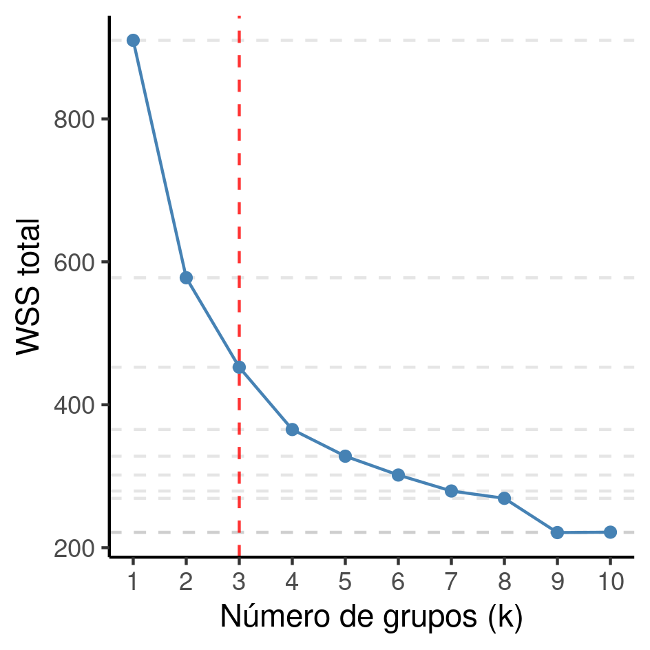

---

**Histórico do documento**

|Versão |Alterações     |
|:------|:--------------|
|01     |Versão inicial |

---

# Lista de abreviaturas

# Introdução

## Objetivos

## Recepção e tratamento dos dados

Uma observação não tinha o número de votos registrada, e foi removida para a análise de clusters.

# Metodologia

## Variáveis

### Desfechos primário e secundário

### Covariáveis

## Análises Estatísticas

### Softwares utilizados

Esta análise foi realizada utilizando-se o software `R` versão 4.1.1.

# Resultados

## Análise descritiva
<!-- dados da tabela adhoc em describe.R -->
Em 2018 foram eleitos 116 (23% dos 512 deputados avaliados) deputados federais que se autodenominaram evangélicos.
Destes,
29 (25%) estão filiados à igreja AD,
21 (18%) à igreja IURD e
15 (13%) à igreja Batista.
Observa-se nas duas classes de deputados federais uma predominância do sexo masculino, com
91 (78%) homens entre os deputados evangélicos e
346 (87%) homens dentre as demais classes
(Tabela 1).
O deputado federal evangélico parece ter posicionamento político mais alinhado à direita, com índice de Power e Silveira-Rodrigues médio 0.7.

A maior parte dos deputados federais eleitos em 2018 foram eleitos em primeiro mandato.
Dentro os deputados evangélicos
94 (81%) se elegeram pela primeira vez e
22 (19%) foram reeleitos.
Os candidatos evangélicos obtiveram, na média, 127 mil votos,
quando os outros deputados obtiveram 97 mil votos.
Apesar da discrepância nas médias de performance de votos, a variabilidade deste indicador é substancialmente maior na classe de deputados evangélicos, com desvio padrão superior à média.
A variabilidade entre os dois grupos pode ser comparada pelo CV -- o CV dos deputados evangélicos foi 157% enquanto nos outros foi 60%.
Ambos os grupos tiveram capilaridade semelhante, em torno de 0.8 na média.

Os partidos tiveram desempenho comparáveis, onde tanto
o decil do número de deputados eleitos como
o decil do número de filiados
ficaram na faixa entre 0,7 e 0,8 (Tabela 1).
Os partidos que mais abrigaram os deputados evangélicos eleitos foram o
PRB com	23 (20%) deputados,
PSL com	16 (14%),
PR com	10 (8.6%) e
os partidos com menor representatividade desta classe foram
PATRIOTA,
PMN,
PRP e
PTC
todos com 1 (0.9%) deputado.

Table: **Tabela 1** Características dos deputados federais eleitos em 2018.

|**Características**                      | **Outros**, N = 397 | **Evangélico**, N = 116 |
|:----------------------------------------|:-------------------:|:-----------------------:|
|__Receita total (milhão R$)__            |     1.12 (0.68)     |       1.08 (0.69)       |
|__Capilaridade__                         |     0.77 (0.15)     |       0.80 (0.16)       |
|__Releição vs primeiro mandato__         |                     |                         |
|Primeiro mandato                         |      345 (87%)      |        94 (81%)         |
|Reeleito                                 |      52 (13%)       |        22 (19%)         |
|__Sexo__                                 |                     |                         |
|Masculino                                |      345 (87%)      |        91 (78%)         |
|Feminino                                 |      52 (13%)       |        25 (22%)         |
|__Votos (100k)__                         |     0.10 (0.06)     |       0.13 (0.20)       |
|__Índice de Power e Silveira-Rodrigues__ |     0.17 (0.50)     |       0.42 (0.30)       |
|__Decil do núm. de filiados__            |     0.79 (0.22)     |       0.70 (0.20)       |
|__Decil do núm. de deputados__           |     0.78 (0.22)     |       0.74 (0.22)       |

A receita total obtida pelos deputados evangélicos foi comparável aos demais deputados, com ambas as classes atingindo receita média superior a 1 milhão de reais.
Os deputados evangélicos obtiveram, na média, 1.08 milhões de reais (desvio padrão 0.7 milhões, CV 64%) e
os demais deputados 1.12 milhões de reais (desvio padrão 0.7 milhões, CV 60%).
A amplitude das receitas observadas variou entre
R\$ 21648 e R\$ 2507377 entre os deputados evangélicos e
R\$ 12075 e R\$ 2500500 entre os demais (Tabela 1 e Figura 1).

**Figura 1** Distribuição da receita total dos deputados federais eleitos em 2018.

## Análise inferencial

**Figura 2** Elbow plot do método k-means.

# Exceções e Observações

# Conclusões

# Referências

- **SAP-2021-011-JG-v01** -- Plano Analítico para Clusterização hierárquica para determinação do número ótimo de clusters para classificação de deputados federais como bancada evangélica
<!-- - Cohen, J. (1988). Statistical power analysis for the behavioral sciences (2nd Ed.). New York: Routledge. -->

# Apêndice

## Análise exploratória de dados

**Figura A1** Distribuição das receitas de deputados federais, por origem (agp = receita que veio do Partido ao invés de apoiadores privados (empresariais ou não); agr = setor agrícola; com = setor do comércio; fin = setor específico dos bancos e outras instituições financeiras e imobiliárias; ind = setores da indústria; inf = setor de infraestrutura; pf = pessoa física; rp = recursos próprios; ser = setor de serviços). 

**Figura A2** Elbow plot do método k-means, com o full dataset.

## Disponibilidade

<!-- Tanto este documento como o plano analítico correspondente (**SAP-2021-011-JG-v01**) podem ser obtidos no seguinte endereço: -->

Este documento pode ser obtido no seguinte endereço:

https://github.com/philsf-biostat/SAR-2021-011-JG/

## Dados utilizados

Os dados utilizados neste relatório não podem ser publicados online por questões de sigilo.

| id  | partido | uf | capilaridade | primeira | sexo | evangelico | num_votos | posicao | decil_filiados | decil_deputados | total_receita |
|:---:|:-------:|:--:|:------------:|:--------:|:----:|:----------:|:---------:|:-------:|:--------------:|:---------------:|:-------------:|
|  1  |         |    |              |          |      |            |           |         |                |                 |               |
|  2  |         |    |              |          |      |            |           |         |                |                 |               |
|  3  |         |    |              |          |      |            |           |         |                |                 |               |
| ... |         |    |              |          |      |            |           |         |                |                 |               |
| 513 |         |    |              |          |      |            |           |         |                |                 |               |

Table: **Table A1** Estrutura da tabela de dados analíticos
